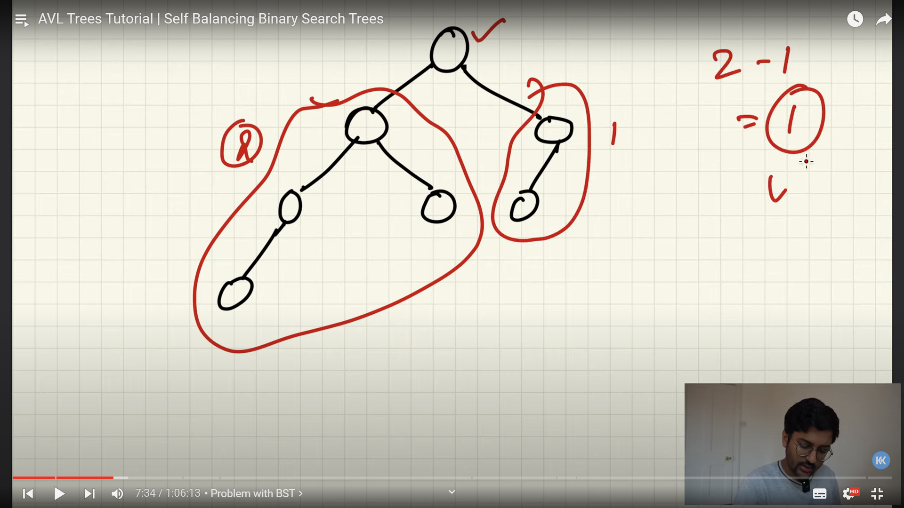

## problem with BST
For example someone starts entering a ascending sorted array.
The issue is, we will get a right side tree which will be unbalanced.
This will make the time complexity to enter or search anything O(N) and it defeats the time complexity effciiency.

## Basic terms
1. Height- Number of edges from the node to the bottom leaf.
## Defining the problem
The difference of height of the left subtree and the right subtree of every single node should be less than or equal to 1.

# Very Important point
## Balanced binary Tree: For every node in the tree, the difference in the height of left and right subtree of that node <=1.
### For every node:
**Height(left)-Height(right)= -1 or +1 or 0**

# Solution?
Answer is : _**Self Balancing Binary Trees**_: this means, a user can keep adding whatever it wants to, the system will keep balancing the tree, through a mechanism and keep the binary tree **BALANCED**.

One Example of such tree: AVL trees

# AVL Trees
### Theory and Algorithm
1. Adelson-Velsky and Landis Trees

#### Algorithm
1. insert normally Node n.
2. Start from node n and find the  node that makes the node unbalanced, this can be done from bottom most place where node is inserted and keep checking where the tree becomes unbalanced .
3. Using of the 4 rules,rotate.

NOTE: Roatation is only performed on 3 nodes.
## 4 Rules

